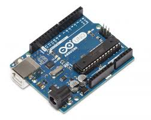

This Quadruped robot was inspired from the open Source Staford Pupper, where the original kit cost was 600$. My robot was designed under 40$(12 servo, drivers, chassis) + 35$(Raspberry Pi). The robot has 12 DoF moving in omnidirectional in a planar surface.

## Definition Lists
Materials Used :
    *  :
    Arduino is the microcontroller for the servo.

    * 

     
    

